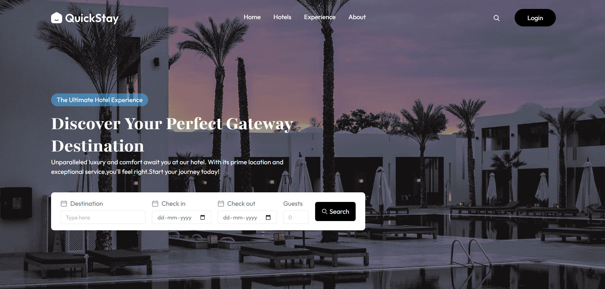

## HOTEL BOOKING (MERN)

A full‑stack hotel booking platform built with React (Vite) and Express/MongoDB. It supports Clerk authentication, hotel owner room management, Stripe payments, Cloudinary image uploads, and email notifications.

### Tech stack
- **Client**: React + Vite, React Router, Clerk, Axios, Tailwind CSS, React Hot Toast
- **Server**: Node.js, Express, Mongoose, Multer, Cloudinary, Stripe, Nodemailer, Clerk

### Preview


### Monorepo layout
```
HOTEL BOOKING/
  client/      # React app (Vite)
  server/      # Express API (MongoDB, Stripe, Clerk)
```

## Prerequisites
- Node.js LTS and npm
- A MongoDB connection string
- Clerk account (publishable + secret keys, webhook secret)
- Stripe account (secret key, webhook signing secret)
- Cloudinary account (cloud name, API key/secret)
- SMTP credentials (e.g., Brevo) for booking emails

## Environment variables

Create a `.env` file in both `server/` and `client/` with the following:

### server/.env
```env
# Server
PORT=3001
MONGODB_URI=mongodb+srv://<user>:<pass>@<cluster>/<db>

# Clerk (server-side)
CLERK_PUBLISHABLE_KEY=pk_test_xxx
CLERK_SECRET_KEY=sk_test_xxx
CLERK_WEBHOOK_SECRET=whsec_xxx

# Stripe
STRIPE_SECRET_KEY=sk_live_or_test
STRIPE_WEBHOOK_SECRET=whsec_xxx

# Cloudinary
CLOUDINARY_CLOUD_NAME=your_cloud_name
CLOUDINARY_API_KEY=your_api_key
CLOUDINARY_API_SECRET=your_api_secret

# Email (Nodemailer)
SMTP_USER=your_smtp_user
SMTP_PASS=your_smtp_pass
SENDER_EMAIL=no-reply@yourdomain.com

# App
CURRENCY=$
```

### client/.env
```env
VITE_BACKEND_URL=http://localhost:3001
VITE_CLERK_PUBLISHABLE_KEY=pk_test_xxx
VITE_CURRENCY=$
```

## Install and run

### 1) API server
```bash
cd server
npm install
npm start
```
The server starts on `http://localhost:3001`.

### 2) Web client
```bash
cd client
npm install
npm run dev
```
The app runs on the Vite dev server (shown in the terminal), proxied to the API via `VITE_BACKEND_URL`.

## API overview
All endpoints are prefixed with `/api`. Endpoints marked with (auth) require a Clerk Bearer token in `Authorization: Bearer <token>`.

- **Health**
  - `GET /` → API is running

- **User (auth)**
  - `GET /api/user` → Current user role, recent search cities
  - `POST /api/user/store-recent-search` → Add a city to recent searches

- **Hotels (auth)**
  - `POST /api/hotels` → Register hotel `{ name, address, contact, city }`

- **Rooms (auth)**
  - `POST /api/rooms` → Create room (multipart form with `images` up to 4; fields: `roomType`, `pricePerNight`, `amenities` as JSON array)
  - `GET /api/rooms` → List available rooms
  - `GET /api/rooms/owner` → List rooms for the authenticated hotel owner
  - `POST /api/rooms/toggle-availability` → Toggle `isAvailable` for a room `{ roomId }`

- **Bookings**
  - `POST /api/bookings/check-availability` → Check room availability `{ room, checkInDate, checkOutDate }`
  - `POST /api/bookings/book` (auth) → Create booking
  - `GET /api/bookings/user` (auth) → User bookings
  - `GET /api/bookings/hotel` (auth) → Hotel owner dashboard data
  - `POST /api/bookings/stripe-payment` (auth) → Start Stripe Checkout `{ bookingId }`

- **Webhooks**
  - `POST /api/clerk/webhooks` → Clerk user lifecycle events (raw body)
  - `POST /api/stripe` → Stripe webhook (raw body, signed)

## Webhook configuration
- **Clerk webhook**: Point a Clerk webhook to `https://<your-api-domain>/api/clerk/webhooks` and use `CLERK_WEBHOOK_SECRET`.
- **Stripe webhook**: Point a Stripe webhook to `https://<your-api-domain>/api/stripe` and use `STRIPE_WEBHOOK_SECRET`. Ensure raw body is forwarded and content type is preserved.

## Common tasks
- Update currency symbol: set `CURRENCY` on the server and `VITE_CURRENCY` on the client.
- Adjust allowed origins/CORS in `server/server.js` if deploying with a custom domain.
- Image uploads: the `POST /api/rooms` endpoint accepts form-data with `images` and uploads to Cloudinary.

## Scripts
- Client: `npm run dev`, `npm run build`, `npm run preview`, `npm run lint`
- Server: `npm start`

## Notes
- Authentication is enforced with Clerk; protected routes require a valid token in the `Authorization` header.
- MongoDB database name defaults to `hotel-booking` appended to `MONGODB_URI`.

## License
This project is provided as-is with no specific license declared.
